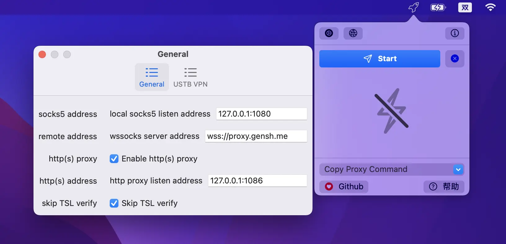

# wssocks-plugin-ustb
[](https://github.com/genshen/wssocks-plugin-ustb/releases)
[](https://github.com/genshen/wssocks-plugin-ustb/actions/workflows/release.yml)


wssocks-plugin-ustb is a **wssocks** plugin, 
used for accessing internal network of [USTB](http://www.ustb.edu.cn) 
when the internal network is not available directly (such as at home).  

This plugin is based on [wssocks](https://github.com/genshen/wssocks), 
which is a socks5 proxy application over websocket protocol.  
See more about wssocks: https://github.com/genshen/wssocks.

## Clients
The available clients for different platforms are list as follows:
- cli: command line client.
- client-ui: From v0.5.0, we also provide a GUI [client](client-ui) for windows and macos.
- swiftui-client: From v0.6.0 and v0.7.0, we also provide a mac native app (build using swiftui). You cn download the app in release page (filename:  `wssocks-ustb-client-macOS-*.app.zip`).

Note: **wssocks** and wssocks-plugin-ustb plugin are all included in both cli and client-ui clients.

**Screenshots**:
| | cli | client-ui | swiftui-client |
| -- | -- | --- |  ------ |
| Screenshots | - |  |  |
| Description | command line app for all platforms. | universal GUI client based on [fyne](https://fyne.io) cross platform toolkit. | macOS native client build using swiftUI. |
| Supported Platforms | Windows x64, macOS x64/arm64, Linux x64/arm64 | Windows x64, macOS x64/arm64 | macOS x64/arm64 |

### install cli client
```bash
go get -u github.com/genshen/wssocks-plugin-ustb/wssocks-ustb
wssocks-ustb --help
```

Or download from github [releases](https://github.com/genshen/wssocks-plugin-ustb/releases) page,
with file name `wssocks-ustb-$OS-$ARCH`.

### install client-ui
You can obtain GUI client from [github releases](https://github.com/genshen/wssocks-plugin-ustb/releases), with file name `client-ui-$OS-$ARCH`.

## Night release clients
If you would like to try new features, you can download wssocks-ustb night release from
[OSDN](https://osdn.net/pkg/wssocks-ustb/wssocks-ustb).

## Document
- [zh-cn](https://genshen.github.io/wssocks-plugin-ustb)
