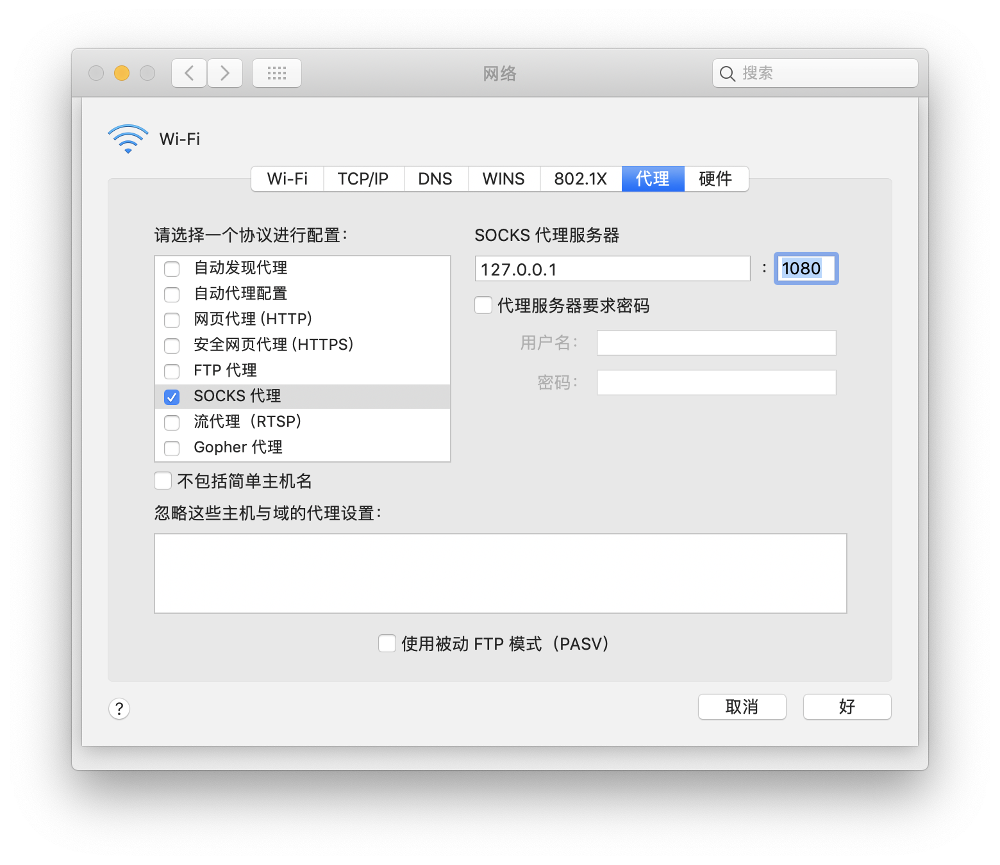
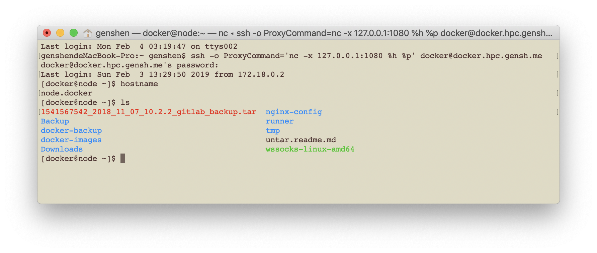

> 从校外网络访问USTB校内网络


## 使用示例:服务端
 在内网的服务端的主机(如地址为`proxy.gensh.me`的主机)上执行:
 ```bash
 # For instance, listener on port 80.
 # And make sure your port has been added to the white list of your firewall.
 wssocks server --addr :80
 ```
 例如上面的命令，在服务端监听80端口(或者是别的端口,但client端`remote`选项需要和其相一致)。另外，需要确保你监听的端口已经被添加到主机防火墙的白名单列表中。

 see more: https://github.com/genshen/wssocks#server-side.

## 使用示例:客户端
1. 打开命令行,执行如下命令,运行客户端:
   > 下面命令中, `wssocks-ustb`可执行程序均指代包含`wssocks-plugin-ustb`插件功能的`wssocks`程序.
   ```bash
   wssocks-ustb client --remote=ws://proxy.gensh.me --vpn-enable   --vpn-host=vpn4.ustb.edu.cn --vpn-force-logout --vpn-host-encrypt
   ```
   以上命令通过启用`--vpn-enable`选项启用通过vpn连接校内到网络。
   随后, 要求输入vpn的用户名和密码登录`vpn4.ustb.edu.cn`以获取其cookie (用户名和密码也可以在命令中通过`--vpn-usernam`和`--vpn-password`选项指定)。  
   此外，客户端默认本地监听地址为`:1080`(即0.0.0.0:1080), 服务器端地址为`ws://proxy.gensh.me`。

   也可以通过`wssocks-ustb client --help`查看更多参数的使用。 其中, 几个主要命令参数如下:
   - `--addr` 指定客户端默认本地监听地址,默认为`:1080`(即0.0.0.0:1080);
   - `--remote` 指定服务器端地址;
   - `--vpn-enable` 是否开启vpn模式;如不开启vpn模式, 将跳过所有以vpn开头的参数;
   - `--vpn-host` vpn服务器主机地址;
   - `--vpn-username` 登录vpn的用户名;如不在命令参数中指定,将会以交互的方式获取;
   - `--vpn-password` 登录vpn的密码; 如不在命令参数中指定,将会以交互的方式获取(为安全起见,不推荐在命令参数中指定);
   - `--vpn-force-logout` 如果账号已经在其他设备上登录,强制退出其他设备上的账号;
   - `--vpn-host-encrypt` 使用 aes 算法加密代理服务器主机名,默认启用;

2. 设置代理  
  使用socks代理客户端软件(如mac系统的全局代理功能), 设置代理地址。
  
  在mac中，勾选**socks代理**选项框, 并填入代理服务器的地址及端口(即wssocks客户端本地监听地址及端口)，保存生效。  
  如果你使用的是windows, 可以使用[Proxifier](https://www.proxifier.com/)软件。  
  (下图proxifier界面来自于  www.proxifier.com , 以展示添加代理方法。使用wssocks时，图中各个字段(如地址和端口)和选项会有区别。)
  

3. 访问网页  
  直接在浏览器地址栏输入对应的地址即可访问，即可访问校内网络,不用任何特殊设置。

4. ssh连接(仅macOS)
   ```bash
   ssh -o ProxyCommand='nc -x 127.0.0.1:1080 %h %p' ssh.hpc.gensh.me
   ```
     
   windows和linux中可直接使用类似的`ssh ssh.hpc.gensh.me`命令。

5. git 命令(仅macOS)
   ```bash
   GIT_SSH_COMMAND="ssh -o ProxyCommand='nc -x 127.0.0.1:1080 %h %p' " git clone repo_address
   ```
   windows和linux中可直接使用类似的`git clone repo_address`命令。
