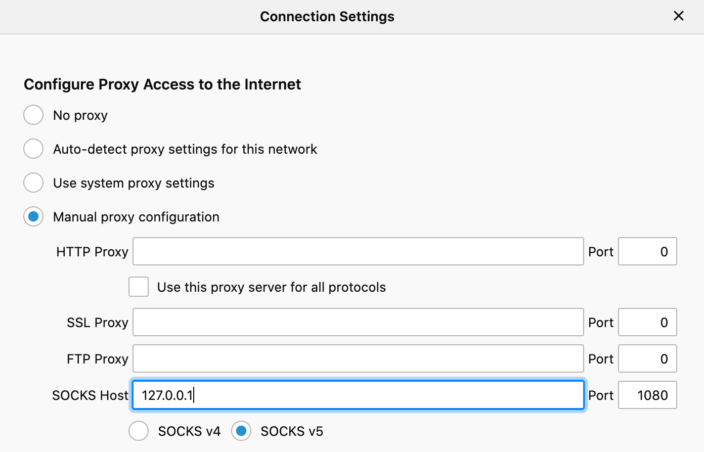
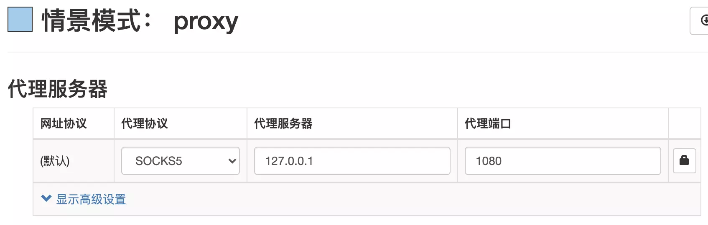

## 浏览器访问校内网站

### Firefox
如果你的系统上安装有 firefox 浏览器，可以通过以下设置来启用 socks5 代理，当然这仅限在该浏览器中访问网页时会启用代理。 


## Chrome、新版Edge (SwitchyOmega插件)
 Tips: 对于基于 chromium 的浏览器，除了命令行启动外，还可以通过 [SwitchyOmega插件](https://github.com/FelisCatus/SwitchyOmega/releases) 来实现代理的访问。
 用户可以从 [github](https://github.com/FelisCatus/SwitchyOmega) 下载安装，
 或者在[Microsoft Store](https://microsoftedge.microsoft.com/addons/detail/fdbloeknjpnloaggplaobopplkdhnikc) (Edge) 或 [Chrome Web Store](https://chrome.google.com/webstore/detail/proxy-switchyomega/padekgcemlokbadohgkifijomclgjgif) (Chrome) 中安装。  
 安装完成后，设置一条规则，其中代理协议为 SOCKS5，代理服务器和端口和 wssocks-ustb 中配置的 "socks5 address" 一致。


## Chrome、新版Edge（命令行启动）
对于基于 chromium 的浏览器(如 Chrome, 新版Edge), 可以在命令行中启动浏览器以使用 socks5 代理:
 ```bash
 # chrome on windows
 # tips: windows 用户可以将这一启动命令设置为快捷方式.
 "C:\Program Files (x86)\Google\Chrome\Application\chrome.exe" --show-app-list --proxy-server="socks5://127.0.0.1:1080" --host-resolver-rules="MAP * 0.0.0.0 , EXCLUDE localhost"
 ```
 ```bash
 # chrome on macOS
 /Applications/Google\ Chrome.app/Contents/MacOS/Google\ Chrome --show-app-list --proxy-server="socks5://127.0.0.1:1080" --host-resolver-rules="MAP * 0.0.0.0 , EXCLUDE localhost"
 ```
 ```bash
 # new Edge on macOS
 /Applications/Microsoft\ Edge.app/Contents/MacOS/Microsoft\ Edge --show-app-list --proxy-server="socks5://127.0.0.1:1080" --host-resolver-rules="MAP * 0.0.0.0 , EXCLUDE localhost"
 ```
 参考: https://github.com/shadowsocks/shadowsocks/wiki/Forcing-Chrome-to-Use-Socks5-Proxy
