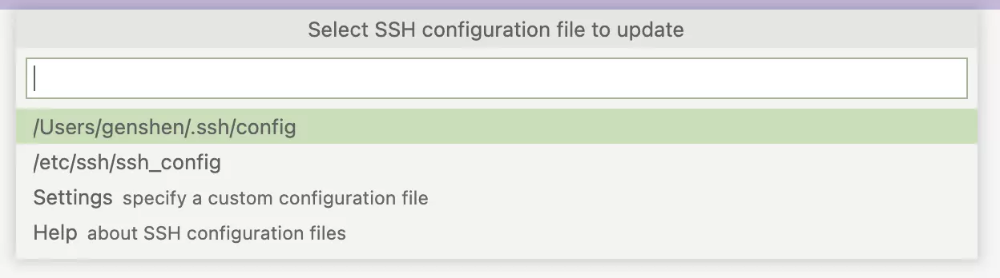
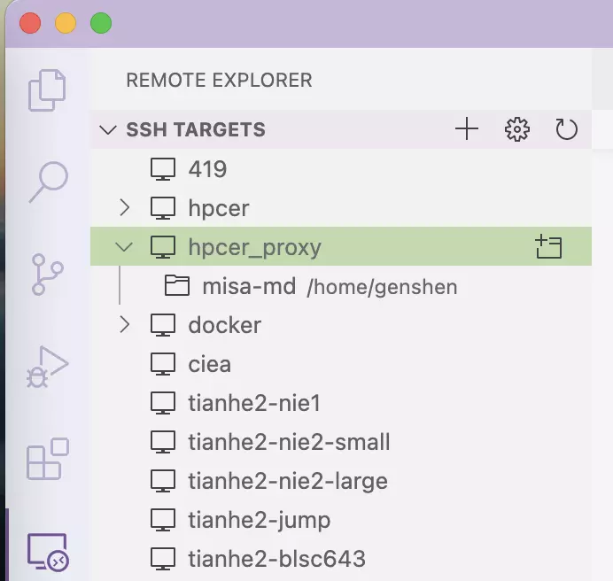

# vscode Remote-SSH 连接
如果你喜欢用 vscode 连接到远程 Linux 服务器（例如只有远程 Linux 服务器才用 GPU 和 CUDA 环境的情况），在上面写代码或允许代码。
可以安装以下配置：

1. 在 **extension** 中搜索并安装 **Remote-SSH** 插件。
2. Ctrl/Command + shift +P 然后输入 remote，选择 "SSH: Open Configuration File…"。
3. 选择并修改位于用户目录下的 ssh 配置文件。
   
   添加一条 ssh 服务器配置:  
   macOS/Linux:
   ```toml
   Host hpcer_proxy
    HostName ssh.hpcer.dev
    User genshen
    ProxyCommand nc -x 127.0.0.1:1080 %h %p
   ```
   Windows:
   ```toml
   Host hpcer_proxy
    HostName ssh.hpcer.dev
    User genshen
    ProxyCommand connect -S 127.0.0.1:1080 %h %p
    # ProxyCommand "C:/Program Files/Git/mingw64/bin/connect.exe" -S 127.0.0.1:1080 %h %p  # Windows full connect path
   ```
   其中，windows 和 macOS/Linux 的 ProxyCommand 配置有所区别，且 windows 上需要安装 git bash 环境才会有 "connect" 命令。

   !> 建议 windows 用户 connect.exe 的路径用完整的绝对路径，因为直接用 `connect -S 127.0.0.1:1080 %h %p` 在部分 windows 上可能会出现连接失败的问题。

4. 在 Remote-SSH 扩展的 SSH TARGET 中，选择刚刚配置的主机，点击连接即可。
  
