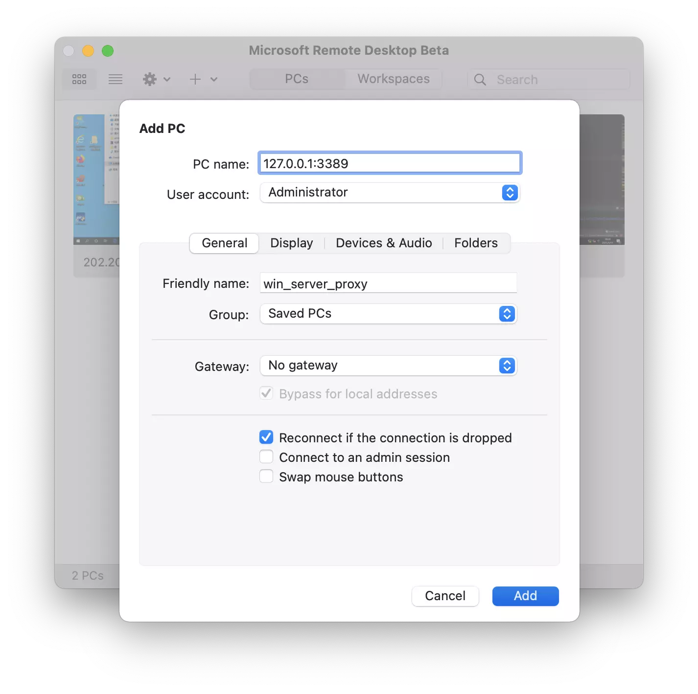
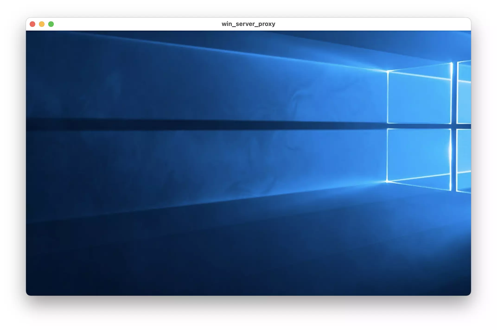

# Windows 远程桌面访问
widnows 远程桌面是基于UDP 协议的，而目前 wssocks 还[不支持 UDP 协议](https://github.com/genshen/wssocks/issues/12)。
但远程桌面访问还是可以通过端口转发来实现的。

连接远程桌面，需要另一台 Linux 服务器配合，请确保你在该 Linux 服务器上有账号并可登录。

## 配置端口转发
启动 wssocks-ustb 客户端后，可先执行以下 ssh 命令，以开启一个ssh 端口转发。
```bash
# macOS
ssh -o ProxyCommand='nc -x 127.0.0.1:1080 %h %p' -N user@ssh.hpcer.dev -L 3389:222.189.197.152:3389
# windows
ssh -o ProxyCommand='connect -S 127.0.0.1:1080 %h %p' -N user@ssh.hpcer.dev -L 3389:222.189.197.152:3389
```

这里，通过将请求转发到校内内网的一台 Linux 服务器 `ssh.hpcer.dev` 上（请确保你在这台服务器上有账号并可登录），
然后这台 Linux 服务器将你的远程连接数据转发到最终的 windows server 上。 
`-L 3389:222.189.197.152:3389` 参数做来一个本地端口转发，将本地的 3389 端口和映射到远程 windows server（windows server 地址为 222.189.197.152）的 3389 端口。
这样端口转发配置后，你访问本地的 3389 端口，就像访问远程 windows server 的 3389 端口一样。


数据流动看起来是这样的:
```
Your laptop ---->wssocks-client ---(gateway)--> wssocks server --(ssh)--> Linux server --(rdp)--> Windows Server
                (Proxy client)                  (Proxy server)          (ssh.hpcer.dev)
```

更多关于端口转发的，可参考网络上的相关技术文档或者 [https://man.linuxde.net/ssh](https://man.linuxde.net/ssh)。

## 配置远程并连接桌面
配置端口转发后，通过访问本地的 3389 端口 (127.0.0.1:3389, 远程桌面默认使用 3389 端口)，即可实现内网 windows server 的远程桌面访问，而看起来就像直接连接到内网的 windows server 上一样。  

因此，就可以在远程桌面应用中，新加一个桌面，地址为 `127.0.0.1:3389`。


然后点击连接，即可访问位于内网的 windows server 服务器了。

